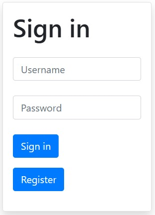

# Data Protection Project
The application allows the logged-in user to store text notes.

## Table of contents
* [General info](#general-info)
* [Technologies](#technologies)
* [Setup](#setup)
* [Functionality](#functionality)
* [Planned changes](#planned-changes)
* [Illustrations](#illustrations)

 
## Introduction 
Application developed during studies. The application allows the user to create, view and edit notes.
The aim of the project was to put the security features of the app into practice.  

## Technologies:

* bleach: 6.1.0
* blinker: 1.7.0
* click: 8.1.7
* colorama: 0.4.6
* Flask: 3.0.2
* Flask-Login: 0.6.3
* gunicorn: 21.2.0
* itsdangerous: 2.1.2
* Jinja2: 3.1.3
* Markdown: 3.6
* MarkupSafe: 2.1.5
* packaging: 24.0
* passlib: 1.7.4
* pycryptodome: 3.20.0
* six: 1.16.0
* webencodings: 0.5.1
* Werkzeug: 3.0.2
* SQLAlchemy-2.0.29

## Setup

Activate Virtual Envirement
``` myenv\Scripts\activate ```

Install the required components:

``` pip install -r requirements.txt ```

Then:

``` sudo docker-compose up --build ```
 
## Functionality
The application allows selected notes (unencrypted) to be made available to other users. Acceptable 
two solutions are allowed:

* notes made available to selected users,
* notes made available to the public.

The notes must allow for basic sharpening, at least: adding bold to a selected word, adding an image from an external site, adding a link, adding an italicisation of a selected word, adding a heading of a selected level

The application has: 
* SQLite database,
* production web server - ngnix
* secure connection to the application encrypted connection,
* validation of user input with a negative bias,
* verification of user access to resources,
* verification of the number of unsuccessful login attempts,
* checking password quality by entropy,


## Planned changes:
* security against Cross-Site Request Forgery (CSRF/XSRF tokens),
* possibility to recover access in case of password loss
* monitoring of system operation (e.g. to inform the user about new computers connecting to his account)
* leaving so-called honeypots,
* content-Security-Policy mechanism,
* disabling the Server header.
* registering and logging in with a password and a second verification component using the TOTP (time-based one-time password) algorithm.

## Illustrations:


